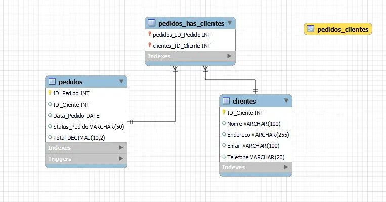

# Exercício de Sistema de Gerenciamento de Banco de Dados

Este exercício envolve a criação de um sistema simples de gerenciamento de banco de dados com duas tabelas (`CLIENTES` e `PEDIDOS`), um procedimento armazenado, um gatilho e uma visão. O banco de dados é projetado para gerenciar informações de clientes e pedidos.

## Instruções

### Estrutura do Banco de Dados

1. **Tabela CLIENTES:**
    - Campos: ID_Cliente, Nome, Endereco, Email, Telefone
    - Exemplo de dados incluído

2. **Tabela PEDIDOS:**
    - Campos: ID_Pedido, ID_Cliente, Data_Pedido, Status_Pedido, Total
    - Relacionamento de chave estrangeira com CLIENTES(ID_Cliente)
    - Exemplo de dados incluído

### Procedure Armazenado

3. **Procedure Inserir_Pedidos:**
    - Insere um novo pedido na tabela PEDIDOS
    - Parâmetros: ID_Cliente, Data_Pedido, Status_Pedido, Total

### Trigger

4. **Trigger Calcular_Total_Pedidos:**
    - Atualiza a coluna TotalPedidos na tabela CLIENTES após cada novo pedido inserido na tabela PEDIDOS

### View

5. **View Pedidos_Clientes:**
    - Combina informações das tabelas CLIENTES e PEDIDOS para recuperação fácil
